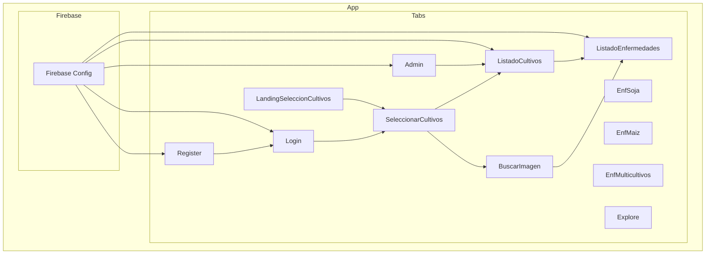

    

    <b>Automatic Architecture Diagrams from Code</b> 
    <a href="https://github.com/swark-io/swark">GitHub</a> • <a href="https://swark.io">Website</a> • <a href="mailto:contact@swark.io">Contact Us</a>

## Usage Instructions

1. **Render the Diagram**: Use the links below to open it in Mermaid Live Editor, or install the [Mermaid Support](https://marketplace.visualstudio.com/items?itemName=bierner.markdown-mermaid) extension.
2. **Recommended Model**: If available for you, use `claude-3.5-sonnet` [language model](vscode://settings/swark.languageModel). It can process more files and generates better diagrams.
3. **Iterate for Best Results**: Language models are non-deterministic. Generate the diagram multiple times and choose the best result.

## Generated Content
**Model**: GPT-4o - [Change Model](vscode://settings/swark.languageModel)  
**Mermaid Live Editor**: [View](https://mermaid.live/view#pako:eNqFVE1vwyAM_SsR5_YP5DCpazdp0nZpeyM7uMGhTAlEJEzbqv73kQ9awkjGAfB7frZjrFxIrhiSlGSSa6jPyXGXycSuxpwGYFPXAzJBj3Bq7nC3NqwSkvb7-5R5ksVBfQAdz7_sG4gfOp4R1pStyLvtUzU0BEL_r7pUGul4BuyraFpgauuCBXbc22ZEXSEDhjeFjwWqA5aY50JJ0Lc8ESxQPZomB_1SAUdJfSOsCSQTkt8C3j9lhgj1ittX6veA2SO334aauovHo2SRGXgWGk_Q4DSOQ7dKFoJTZyaDHQvaX4brVJys1w_DXM2ywQv-5-e_27xv151Z1rXHldzXN19LAC4XE5mTXuAPxLJntAZfvlzA3BT1qkjOUdU1bNnFdc1vMFmRyuYHwez_55KR9owVZiRNMsKwAKvPyNU6mZpBizsBduwqkrba4IqAadXhW-bO1srwM0kLKBu8_gLcn5PF) | [Edit](https://mermaid.live/edit#pako:eNqFVE1vwyAM_SsR5_YP5DCpazdp0nZpeyM7uMGhTAlEJEzbqv73kQ9awkjGAfB7frZjrFxIrhiSlGSSa6jPyXGXycSuxpwGYFPXAzJBj3Bq7nC3NqwSkvb7-5R5ksVBfQAdz7_sG4gfOp4R1pStyLvtUzU0BEL_r7pUGul4BuyraFpgauuCBXbc22ZEXSEDhjeFjwWqA5aY50JJ0Lc8ESxQPZomB_1SAUdJfSOsCSQTkt8C3j9lhgj1ittX6veA2SO334aauovHo2SRGXgWGk_Q4DSOQ7dKFoJTZyaDHQvaX4brVJys1w_DXM2ywQv-5-e_27xv151Z1rXHldzXN19LAC4XE5mTXuAPxLJntAZfvlzA3BT1qkjOUdU1bNnFdc1vMFmRyuYHwez_55KR9owVZiRNMsKwAKvPyNU6mZpBizsBduwqkrba4IqAadXhW-bO1srwM0kLKBu8_gLcn5PF)

